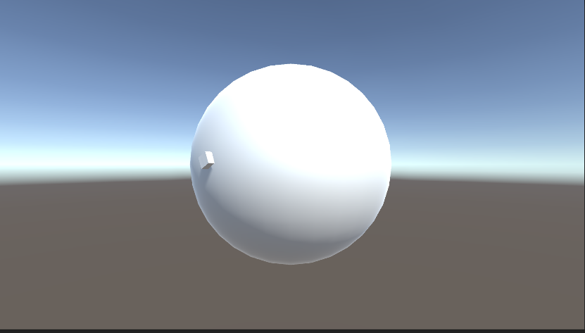

通过射线，两者贴合




```
using System.Collections;
using System.Collections.Generic;
using UnityEngine;

public class UDRay : MonoBehaviour {
    private UDCameraRays _ray;
    public Camera _camera;
    public Transform _cube;
    private RaycastHit _hit;
    // Use this for initialization
    void Start () {
		
	}
	
	// Update is called once per frame
	void Update () {
        if (Input.GetMouseButton(0))
        {
            if (_ray == null) { _ray = new UDCameraRays(); }

            _hit=_ray.CameraRay(_camera, Input.mousePosition, 100, 0);
            _cube.transform.position = _hit.point;
            Quaternion nextPoint = Quaternion.LookRotation(Vector3.Cross(_hit.normal, Vector3.Cross(_cube.transform.forward, _hit.normal)), _hit.normal);
            _cube.transform.localRotation= Quaternion.Lerp(_cube.transform.rotation, nextPoint, 0.1f);
        }
    }
}

public class UDCameraRays
{
    public Ray _ray;
    public RaycastHit _hit;

 
 
    public RaycastHit CameraRay(Camera camera, Vector3 pos, int distance, LayerMask layer)
    {
        _ray = camera.ScreenPointToRay(pos);
        if (Physics.Raycast(_ray, out _hit, distance))
        {
            Debug.DrawLine(camera.transform.position, _hit.point, Color.red);

            return _hit;
        }
        return _hit;
    }
}
```